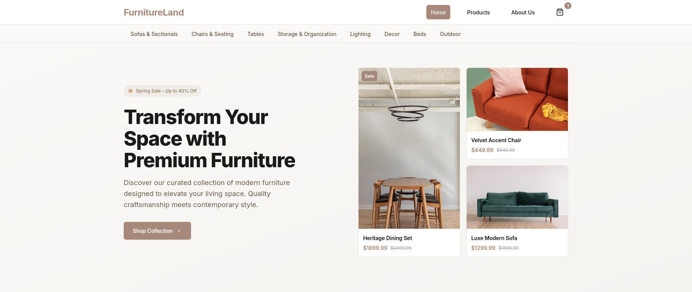

# OwnStak Next.js Ecommerce Example

This is an example Next.js ecommerce application designed to be deployed on OwnStak.



## Quick Start

### Clone and Install

```bash
npx gitpick https://github.com/OwnStak/ownstak-examples/tree/main/ownstak-nextjs-ecommerce
cd ownstak-nextjs-ecommerce
npm install
```

### Building for Production

```bash
npx ownstak build
```

### Preview Production Build Locally

```bash
npx ownstak start
```

### Deploy to OwnStak

```bash
npx ownstak deploy
```

## Learn More

- [Next.js Documentation](https://nextjs.org/docs)
- [OwnStak Documentation](https://docs.ownstak.com/)
