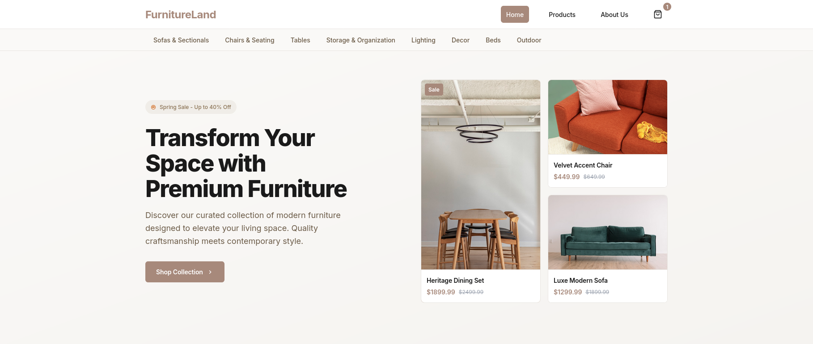

# OwnStak Next.js Ecommerce Example
This is an **ecommerce site example project** built with Next.js. It demonstrates an online store with category filtering, infinite scroll, and a clean UI. 

## Requirements
- Node.JS >= 18.x
- NPM >= 8.x

## Setup
1. Clone this repository
2. Run `npm install` or `yarn install`
3. Start the development server:
   ```bash
   npm run dev
   # or
   yarn dev
   ```
4. Visit [http://localhost:3000/products](http://localhost:3000/products) to browse the demo store

## Notes
- All product data and images are for demonstration only and do not represent real products or inventory.
- You can add your own images to the `public/images` folder for a more realistic look.

---


**This project is for learning and demo purposes only.**

## Getting Started

First, run the development server:

```bash
npm run dev
```

Open [http://localhost:3000](http://localhost:3000) with your browser to see the result.

You can start editing the page by modifying `pages/index.js`. The page auto-updates as you edit the file.

## Learn More

To learn more about Next.js, take a look at the following resources:

- [Next.js Documentation](https://nextjs.org/docs) - learn about Next.js features and API.
- [Learn Next.js](https://nextjs.org/learn-pages-router) - an interactive Next.js tutorial.
